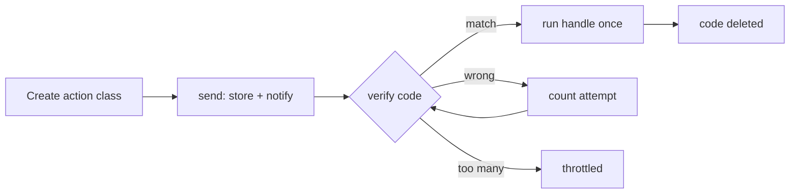

# Laravel Action OTP

[](https://github.com/jtargosz/laravel-action-otp/actions)
[](https://packagist.org/packages/jtargosz/laravel-action-otp)
[](https://packagist.org/packages/jtargosz/laravel-action-otp)
[](https://packagist.org/packages/jtargosz/laravel-action-otp)
[](https://laravel.com/docs/13.x)
[](LICENSE)

Action based one time codes for Laravel 13. Each code is linked to an action class, and the action runs only after the code is verified.

> Building with an AI assistant? The full API in plain text lives in [`llms.txt`](llms.txt). Point your agent at that file first.

Typical uses: registration, login 2FA, password reset, phone confirmation.

## Why this package

- No database tables. Codes live in cache and clean up after themselves.
- The action runs exactly once, only after a correct code. No half created users.
- Throttling and expiry built in, no extra setup.
- Works with any notifiable: User model, mail route, SMS channel.
- Translated messages in 8 languages.
- Optional validation rule and AI tools included.

## Contents

- [How it works](#how-it-works)
- [Why this package](#why-this-package)
- [Requirements](#requirements)
- [Install](#install)
- [Quick start](#quick-start)
- [API](#api)
- [Examples](#examples)
- [Config](#config)
- [Notifications](#notifications)
- [Security](#security)
- [Testing](#testing)
- [Use with Laravel AI SDK](#use-with-laravel-ai-sdk)
- [Translations](#translations)
- [Contributing](#contributing)
- [License](#license)

## How it works

1. You create an action class with a `handle()` method. It holds the data and the work to do.
2. You send a code with `ActionOtp::to($id)->send($action, $notifiable)`.
3. The user types the code. `verify($code)` checks it, runs `handle()` once and deletes the code.

The code never runs the action before verification. Wrong codes are throttled, expired codes are rejected.



Note: this package sends short codes by mail or SMS and runs a follow-up action. It is not TOTP (authenticator apps) and not a replacement for passkeys.

## Requirements

- PHP 8.3, 8.4 or 8.5
- Laravel 13
- A persistent cache driver (file, database, redis, memcached). The array driver loses codes between requests, the null driver disables the package. The database driver needs the `cache_locks` table next to the `cache` table.

## Install

```bash
composer require jtargosz/laravel-action-otp
```

Publish the config (optional):

```bash
php artisan vendor:publish --tag=action-otp-config
```

## Quick start

Generate an action:

```bash
php artisan make:otp-action RegisterUserAction
```

Fill it in:

```php
<?php

namespace App\OtpActions;

use App\Models\User;
use Illuminate\Support\Facades\Hash;
use Jtargosz\ActionOtp\Contracts\VerifiableAction;

class RegisterUserAction implements VerifiableAction
{
    public function __construct(
        public string $name,
        public string $email,
        public string $password,
    ) {
    }

    public function handle(): mixed
    {
        return User::create([
            'name' => $this->name,
            'email' => $this->email,
            'password' => Hash::make($this->password),
        ]);
    }
}
```

Send the code:

```php
use App\OtpActions\RegisterUserAction;
use Illuminate\Support\Facades\Notification;
use Jtargosz\ActionOtp\Facades\ActionOtp;

Route::post('/register', function (Request $request) {
    $data = $request->validate([
        'name' => ['required', 'string', 'max:255'],
        'email' => ['required', 'email', 'unique:users,email'],
        'password' => ['required', 'string', 'min:8'],
    ]);

    ActionOtp::to($data['email'])->send(
        new RegisterUserAction($data['name'], $data['email'], $data['password']),
        Notification::route('mail', $data['email'])
    );

    return response()->json(['message' => 'Code sent.']);
})->middleware('throttle:5,1');
```

Keep a unique index on `users.email`. Request validation alone races under parallel registrations, the database is the final guard.

Verify the code. `payload` holds whatever `handle()` returned:

```php
use Jtargosz\ActionOtp\Facades\ActionOtp;

Route::post('/verify', function (Request $request) {
    $data = $request->validate([
        'email' => ['required', 'email'],
        'code' => ['required', 'string'],
    ]);

    $result = ActionOtp::to($data['email'])->verify($data['code']);

    if (! $result->ok()) {
        return response()->json(['message' => $result->message], 422);
    }

    return response()->json(['user' => $result->payload]);
})->middleware('throttle:10,1');
```

## API

Every call starts with `to()`, which scopes the code to one identifier (email, phone or user id). Identifiers are compared exactly, so normalize them first, for example `strtolower()` emails, or `User@x.com` and `user@x.com` get separate codes:

| Call | What it does | Returns |
| --- | --- | --- |
| `send($action, $notifiable)` | Stores the action, generates a code, sends the notification. Replaces any pending code for the identifier | `sent`, or `throttled` during cooldown |
| `verify($code)` | Checks the code, runs `handle()` once, deletes the code | `verified` + `payload`, or `mismatch`, `empty`, `expired`, `throttled` |
| `peek($code)` | Checks the code without running `handle()` and without deleting it | `matched`, `mismatch`, `empty`, `expired`, `throttled` |
| `resend()` | Generates a new code for the stored action and sends it again | `sent`, `empty` or `throttled` |
| `clear()` | Deletes the code, throttle counters and send cooldown | void |

The result object:

```php
$result->status;  // OtpStatus enum: sent, matched, verified, empty, mismatch, throttled, expired
$result->message; // translated string for the status
$result->payload; // mixed, set only when verified
$result->ok();    // true when verified
$result->found(); // true when matched or verified
```

The code is consumed before `handle()` runs, so a throwing `handle()` does not leave a reusable code. The user resends and tries again.

## Examples

Login with 2FA. Send to the User model, log in after verify:

```php
use Illuminate\Support\Facades\Auth;
use Jtargosz\ActionOtp\Facades\ActionOtp;

ActionOtp::to($user->email)->send(new ConfirmLoginAction($user->id), $user);

$result = ActionOtp::to($user->email)->verify($code);

if ($result->ok()) {
    Auth::loginUsingId($result->payload);
}
```

Password reset. The password changes only after verify:

```php
use App\Models\User;
use Illuminate\Support\Facades\Hash;
use Jtargosz\ActionOtp\Contracts\VerifiableAction;

class ResetPasswordAction implements VerifiableAction
{
    public function __construct(public string $email, public string $password)
    {
    }

    public function handle(): mixed
    {
        $user = User::where('email', $this->email)->firstOrFail();
        $user->update(['password' => Hash::make($this->password)]);

        return $user;
    }
}

ActionOtp::to($email)->send(
    new ResetPasswordAction($email, $password),
    Notification::route('mail', $email)
);
```

Resend a fresh code when the message got lost. Honors the send cooldown:

```php
$result = ActionOtp::to($email)->resend();

if ($result->status !== OtpStatus::Sent) {
    return response()->json(['message' => $result->message], 429);
}
```

Check without consuming, for live validation of a single field:

```php
$result = ActionOtp::to($email)->peek($code);

return match ($result->status) {
    OtpStatus::Matched => response()->json(['ok' => true]),
    OtpStatus::Throttled => response()->json(['message' => $result->message], 429),
    default => response()->json(['message' => $result->message], 422),
};
```

Cancel the flow, for example on logout:

```php
ActionOtp::to($email)->clear();
```

Validate the code as a form field, without consuming it:

```php
use Jtargosz\ActionOtp\Validation\ValidOtpCode;

$request->validate([
    'email' => ['required', 'email'],
    'code' => ['required', 'string', new ValidOtpCode($request->input('email'))],
]);
```

The rule uses `peek()`, so the code stays valid until you call `verify()`. A wrong code in the rule counts as an attempt, same as `peek()`, so a failed validation followed by a failed `verify()` burns two tries.

## Config

File `config/action-otp.php`:

| Key | Default | Meaning |
| --- | --- | --- |
| `code_format` | `numeric` | `numeric`, `alpha` or `alphanumeric` |
| `code_length` | `6` | Code length |
| `ttl_minutes` | `15` | Code lifetime |
| `expired_grace_minutes` | `5` | How long an expired code stays readable as `expired` (0 disables) |
| `max_attempts` | `5` | Wrong tries before lock |
| `throttle_seconds` | `60` | Lock duration (0 disables the lock) |
| `send_cooldown` | `30` | Min seconds between sends (0 disables) |
| `store_prefix` | `action-otp:` | Cache key prefix |
| `notification` | `CodeMail::class` | Notification class |
| `channels` | `['mail']` | Delivery channels |

Env keys: `ACTION_OTP_FORMAT`, `ACTION_OTP_LENGTH`, `ACTION_OTP_TTL`, `ACTION_OTP_GRACE`, `ACTION_OTP_ATTEMPTS`, `ACTION_OTP_THROTTLE`, `ACTION_OTP_COOLDOWN`, `ACTION_OTP_PREFIX`.

## Notifications

The default mail is `Jtargosz\ActionOtp\Mail\CodeMail`. To use your own class, set it in config. It receives the full record in the constructor:

```php
public function __construct(protected array $record)
```

Record keys: `action`, `notifiable`, `code`, `expires_at`. Your class can send mail, SMS or push.

Keep actions serializable. Most cache drivers serialize records, so avoid closures in action properties. If the action holds an Eloquent model, use the `SerializesModels` trait so `handle()` works on fresh data.

<details>
<summary>SMS example with Vonage</summary>

```php
<?php

namespace App\Notifications;

use Illuminate\Notifications\Messages\VonageMessage;
use Illuminate\Notifications\Notification;

class CodeSms extends Notification
{
    public function __construct(protected array $record)
    {
    }

    public function via(object $notifiable): array
    {
        return ['vonage'];
    }

    public function toVonage(object $notifiable): VonageMessage
    {
        return (new VonageMessage)
            ->content('Your code: '.$this->record['code']);
    }
}
```

```php
'notification' => App\Notifications\CodeSms::class,
```

</details>

## Security

- Codes are compared with `hash_equals`.
- The identifier is stored as SHA-256, never plain text in the cache key.
- Cache keys start with `store_prefix`. If several apps share one cache backend, set a unique `ACTION_OTP_PREFIX` per app, otherwise they read and overwrite each other's codes and counters.
- After `max_attempts` wrong tries the identifier is locked for `throttle_seconds`.
- Sends are limited by `send_cooldown`. Protect your send and resend routes with Laravel rate limiting as well. The route examples in this file ship with `throttle` middleware, keep it or tighten it.
- Statuses tell `empty` apart from `mismatch`, so a caller can probe whether an identifier has a pending code. If identifiers are sensitive in your app, put these routes behind auth or rate limiting.
- `verify()` consumes the code under an atomic lock, so two parallel requests cannot run `handle()` twice.
- The pending action waits in cache until verified, including any data you pass to it. Treat the cache as trusted storage, keep `ttl_minutes` short and avoid stuffing secrets you do not need.
- `CodeSent` carries the full record, including the action payload. If you log event payloads (Telescope does by default), exclude this event or keep secrets out of the action.
- Expired codes are deleted on first use and return status `expired`.
- Events `CodeSent`, `CodeVerified` and `CodeFailed` are dispatched for logs and metrics.

## Testing

Use array cache and fake notifications:

```php
Notification::fake();

ActionOtp::to('test@example.com')->send(
    new RegisterUserAction('A', 'test@example.com', 'secret123'),
    Notification::route('mail', 'test@example.com')
);
```

Read the code in a test through the vault:

```php
$record = app(Jtargosz\ActionOtp\Contracts\StoresCodes::class)
    ->scope('test@example.com')->get();
```

## Use with Laravel AI SDK

The package suggests `laravel/ai` but does not require it. Two tools are included for agents:

- `Jtargosz\ActionOtp\Ai\SendOtpTool`
- `Jtargosz\ActionOtp\Ai\VerifyOtpTool`

```bash
composer require laravel/ai
```

```php
public function tools(): iterable
{
    return [
        new \Jtargosz\ActionOtp\Ai\SendOtpTool,
        new \Jtargosz\ActionOtp\Ai\VerifyOtpTool,
    ];
}
```

Expose these tools only to authenticated, trusted agents. A model with these tools can send codes and probe them within the throttle limits, so never attach them to a public or anonymous agent.

## Translations

Ships with `en`, `pl`, `it`, `es`, `de`, `fr`, `pt` and `nl`. Publish with tag `action-otp-lang` and edit as needed. To add a language, copy `lang/en/action-otp.php` to `lang/{locale}/action-otp.php` with the same keys.

## Contributing

See CONTRIBUTING.md. Bug reports and small focused PRs are welcome.

## License

MIT. See LICENSE.
